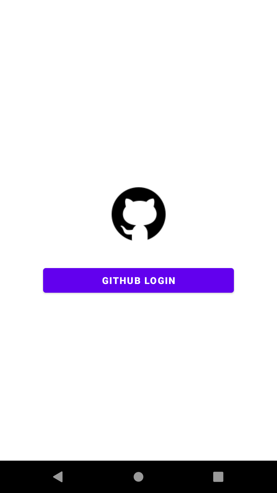
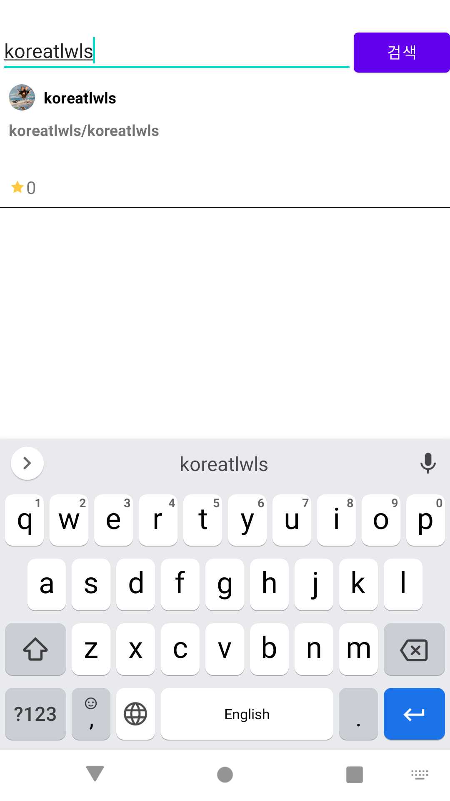
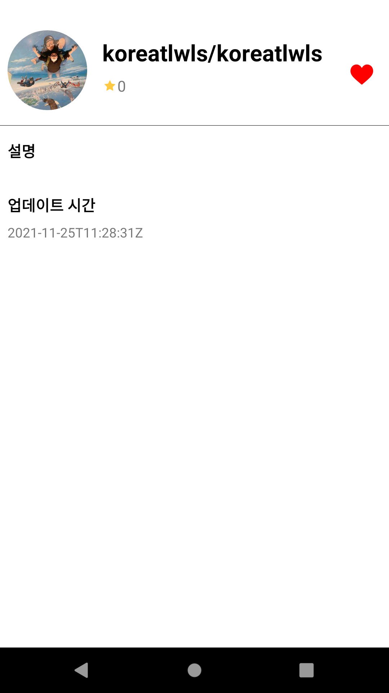

# Android Clone Coding Project #20 Git
Github ID를 통해 로그인
 
Github Repository를 찜해서 저장할 수 있음
 
# 결과화면
|Screenshot1|Screenshot2|
|---|---|
|||
|||

 

# 배운 내용 정리
- RecyclerView 사용하기
- View Binding 사용하기
- Coroutines 사용하기
- Github Api 사용하기
- Room 사용하기

